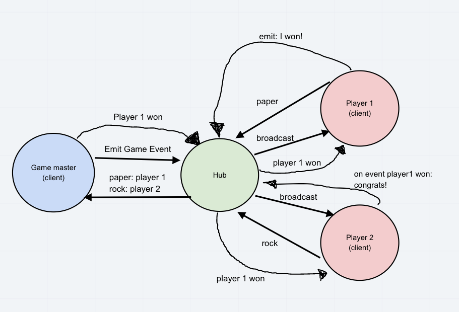

# lab-14 ROSHAMBO

## Description

- Create a new application using real-time events

- Your team will be responsible for planning, executing, and presenting an application that showcases an event driven architecture

- Your application must employ the following programming concepts:

  1. A “hub” server that moderates all events

  1. Multiple “clients” that connect to the hub which can both publish and subscribe to events

  1. Must operate over a network

## Authors: Carly Dekock & Jason Quaglia

- [Link to PR on Github](https://github.com/carlydekock/rock-paper-scissors/pull/2)

## The Setup

### Getting Started

1. Clone down the repository

1. Run the command `npm install` from inside `vendor` and `server` folders.

### Testing the Server

1. Open 3 terminal windows to each of the 3 folders listed above.

1. In `server` run the command `node server.js`

1. In `vendors` run the command `node player1.js`

1. In a separate `vendors` window run the command `node player2.js`

1. You should see in the server window the connections, game start events, player choices, and the winner.

1. You will see a dialogue between the two clients to play `ROSHAMBO`

## UML

